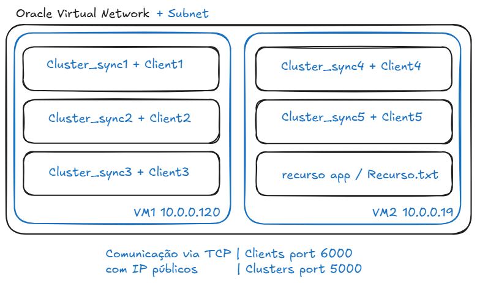

# Exclusão Mútua Distribuída (Ricart-Agrawala)

Trabalho da disciplina de Sistemas Distribuídos - UFOP
Professor: Joubert de Castro Lima 
Alunos: Jouberth Matheus, Cauã Guenrik, Enzo Bernardes

Este projeto implementa um sistema de exclusão mútua distribuída utilizando o algoritmo de Ricart-Agrawala. O objetivo é coordenar o acesso de múltiplos processos concorrentes a um recurso compartilhado (escrita em arquivo) sem a necessidade de um servidor central de controle de locks.

## Arquitetura



O sistema é composto por 3 arquivos pincipais, e utilizamos Virtual Machines na Oracle Cloud para simular um cluster.

### 1. Cliente (`cliente.py`)
Solicita acesso ao recurso e, quando autorizado, realiza a escrita.

### 2. Middleware/Sync (`cluster_sync.py`)
Processo que roda em cada nó. Implementa o algoritmo de Ricart-Agrawala, trocando mensagens (`REQUEST`, `OK`) com os pares para decidir quem tem permissão de acesso.

### 3. Recurso (`recurso.py`)
Servidor TCP simples que centraliza as escritas no arquivo `RECURSO.txt` para validação do teste.

**Tecnologias utilizadas:** Python 3, Sockets TCP, Threading

## Configuração

No arquivo `configuracoes.py`, defina os nós participantes do cluster:

```python
NOS = [
    {"id": 1, "ip": "10.0.0.120", "p2p_port": 5001, "client_port": 6001},
    {"id": 2, "ip": "10.0.0.120", "p2p_port": 5002, "client_port": 6002},
    # ... adicione os demais nós
]
```

## Como Executar

Você pode rodar manualmente.

Execução Manual (Python)

**1. Inicie o Recurso:**

```bash
python3 recurso.py
```

**2. Inicie os Middlewares (Cluster Sync):**

Abra um terminal para cada nó e execute:

```bash
python3 cluster_sync.py 1
python3 cluster_sync.py 2
# ...
```

**3. Inicie os Clientes:**

Após todos os middlewares estarem rodando:

```bash
python3 cliente.py 1
python3 cliente.py 2
# ...
```

## Verificando a Exclusão Mútua

Para confirmar que o algoritmo funcionou corretamente:

1. **Verifique o arquivo gerado `RECURSO.txt`**
   - As linhas devem estar ordenadas temporalmente e sem escritas sobrepostas

2. **Nos logs do `cluster_sync.py`, procure por mensagens:**
   - `[LOG] REQ de X postergado`: Indica que o algoritmo bloqueou um nó para garantir a prioridade (Fairness)
   - `<<< LIBERANDO RECURSO >>>`: Indica o fim da seção crítica e o envio de "OKs" represados

## Estrutura de Arquivos

```
.
├── cliente.py           # Aplicação final
├── cluster_sync.py      # Lógica do Ricart-Agrawala (Middleware)
├── recurso.py           # Servidor de arquivos central
├── configuracoes.py     # Lista de IPs e Portas
└── README.md           # Este arquivo
```

## Sobre o Algoritmo de Ricart-Agrawala

O algoritmo de Ricart-Agrawala é uma solução de exclusão mútua distribuída que garante:

- **Exclusão mútua:** Apenas um processo acessa o recurso por vez
- **Deadlock-free:** O sistema nunca entra em deadlock
- **Fairness:** Requisições são atendidas em ordem de timestamp lógico

### Funcionamento

1. Quando um nó deseja acessar o recurso, ele envia uma mensagem `REQUEST` com timestamp para todos os outros nós
2. Um nó que recebe um `REQUEST`:
   - Responde imediatamente com `OK` se não estiver interessado no recurso
   - Adia a resposta se estiver interessado e seu próprio request tiver timestamp maior (menor prioridade)
   - Responde com `OK` após liberar o recurso se estava na seção crítica
3. Um nó só entra na seção crítica após receber `OK` de todos os outros nós

## Requisitos

- Python 3.7 ou superior
- Rede configurada entre os nós (se estiver usando múltiplas máquinas)

## Licença

Este projeto é para fins educacionais.

## Referências

- Ricart, G., & Agrawala, A. K. (1981). An optimal algorithm for mutual exclusion in computer networks. Communications of the ACM, 24(1), 9-17.