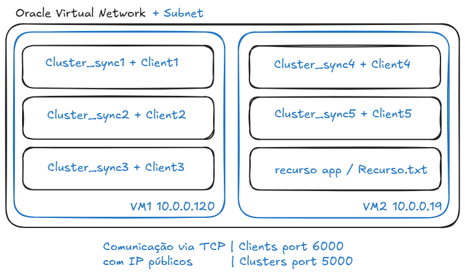
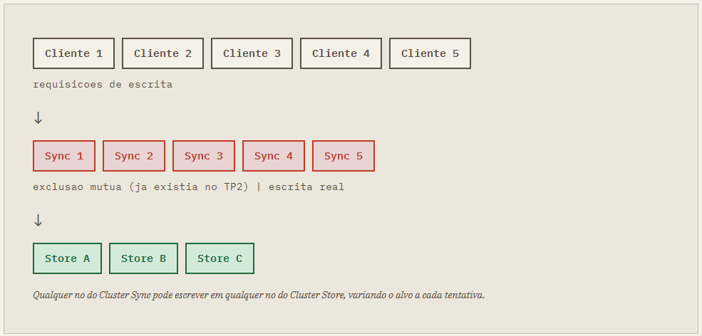

# Exclusão Mútua Distribuída (Ricart-Agrawala)

Trabalho da disciplina de Sistemas Distribuídos - UFOP\
Professor: Joubert de Castro Lima \
Alunos: Jouberth Matheus, Cauã Guenrik, Enzo Bernardes

Este projeto implementa um sistema de exclusão mútua distribuída utilizando o algoritmo de Ricart-Agrawala. O objetivo é coordenar o acesso de múltiplos processos concorrentes a um recurso compartilhado (escrita em arquivo) sem a necessidade de um servidor central de controle de locks. 

Esse trabalho foi dividido em 3 versões:
Esse trabalho foi dividido em 3 versões:

- Versão 1.0: Uso de Free Virtual Machines na Oracle Cloud.

- Versão 2.0: Utilização do Docker para facilitar a simulação do cluster em múltiplas máquinas e delegação do acesso ao Middleware.

- Versão 3.0: Aperfeiçoamento adicionando replicações do recurso para garantir maior disponibilidade e tolerância a falhas, além da implementação de um mecanismo de detecção e reparo de nós inativos.

## Arquitetura da versão 1.0



O sistema é composto por 3 arquivos pincipais, e utilizamos duas Free Virtual Machines na Oracle Cloud para simular um cluster.

### 1. Cliente (`cliente.py`)
Solicita acesso ao recurso e, quando autorizado, realiza a escrita.

### 2. Middleware/Sync (`cluster_sync.py`)
Processo que roda em cada nó. Implementa o algoritmo de Ricart-Agrawala, trocando mensagens (`REQUEST`, `OK`) com os pares para decidir quem tem permissão de acesso.

### 3. Recurso (`recurso.py`)
Servidor TCP simples que centraliza as escritas no arquivo `RECURSO.txt` para validação do teste.

**Tecnologias utilizadas:** Python 3, Sockets TCP, Threading

## Configuração

No arquivo `configuracoes.py`, defina os nós participantes do cluster:

```python
NOS = [
    {"id": 1, "ip": "10.0.0.120", "p2p_port": 5001, "client_port": 6001},
    {"id": 2, "ip": "10.0.0.120", "p2p_port": 5002, "client_port": 6002},
    # ... adicione os demais nós
]
```

## Como Executar

Você pode rodar manualmente.

Execução Manual (Python)

**1. Inicie o Recurso:**

```bash
python3 recurso.py
```

**2. Inicie os Middlewares (Cluster Sync):**

Abra um terminal para cada nó e execute:

```bash
python3 cluster_sync.py 1
python3 cluster_sync.py 2
# ...
```

**3. Inicie os Clientes:**

Após todos os middlewares estarem rodando:

```bash
python3 cliente.py 1
python3 cliente.py 2
# ...
```

## Verificando a Exclusão Mútua

Para confirmar que o algoritmo funcionou corretamente:

1. **Verifique o arquivo gerado `RECURSO.txt`**
   - As linhas devem estar ordenadas temporalmente e sem escritas sobrepostas

2. **Nos logs do `cluster_sync.py`, procure por mensagens:**
   - `[LOG] REQ de X postergado`: Indica que o algoritmo bloqueou um nó para garantir a prioridade (Fairness)
   - `<<< LIBERANDO RECURSO >>>`: Indica o fim da seção crítica e o envio de "OKs" represados

## Estrutura de Arquivos

```
v1.0 Nuvem/
├── cliente.py           # Aplicação final
├── cluster_sync.py      # Lógica do Ricart-Agrawala (Middleware)
├── recurso.py           # Servidor de arquivos central
├── configuracoes.py     # Lista de IPs e Portas
└── README.md           # Este arquivo
```
## Arquitetura da versão 2.0

A versão 2.0 tem algumas correções sugeridas pelo professor, e também tem a adição do Docker para facilitar a execução e simulação do cluster em múltiplas máquinas. 

A principal correção foi manter deixar o acesso ao recurso sendo orquestrado pelo middleware (cluster_sync.py) e não mais pelo cliente, ou seja, o cliente só solicita acesso ao recurso, e o middleware é quem decide quando o cliente pode acessar o recurso, e é quem faz a escrita no arquivo.
Na versão anterior o cliente acessava diretamente o recurso através do recurso.py.

Sobe o Docker, cada nó do cluster é representado por um container Docker, e a comunicação entre eles é feita através de uma rede Docker personalizada.

```
v2.0 Docker/
 ├── cliente.py
 ├── cluster_sync.py
 ├── configuracoes.py
 ├── recurso.py
 ├── run.sh              
 ├── Dockerfile          
 └── docker-compose.yml  
```

O run.sh é um script para facilitar a construção e execução dos containers, enquanto o Dockerfile define a imagem base e as dependências necessárias para rodar os scripts Python. O docker-compose.yml orquestra a criação dos containers e a configuração da rede entre eles.


### Docker

Para rodar tudo é so abrir o terminal na mesma pasta do projedo e executar o comando:

```bash
docker-compose up --build
```

Ele vai ligar o primeiro:

- recurso.py
- 5 nodes de cluster_sync.py + cliente.py

## Arquitetura da versão 3.0

```
v3.0 Replicação e Tolerância a Falhas/
 ├── cliente.py
 ├── cluster_sync.py
 ├── configuracoes.py
 ├── cluster_store.py
 ├── run.sh              
 ├── Dockerfile          
 └── docker-compose.yml  
```

A versão 3.0 é uma extensão da versão 2.0, onde adicionamos replicações do recurso para garantir maior disponibilidade e tolerância a falhas, além de implementar um mecanismo de detecção de falhas para lidar com nós que possam ficar inativos durante a execução.

Para atingir a tolerância a falhas, implementamos:
+ Protocolo de Votação (Quórum): Baseado no algoritmo de Thomas e Gifford, onde as escritas são replicadas. Definimos o quórum de escrita como Nw = 2. Isso significa que o sistema precisa da confirmação de gravação de pelo menos a maioria (2 de 3 nós) para validar a ação, evitando conflitos.

+ Heartbeat (Monitoramento Ativo): O Middleware envia mensagens periódicas de controle do tipo PING para o Cluster Store. Se um nó não responde, ele é marcado como inativo e o sistema roteia as requisições para os sobreviventes, mantendo a disponibilidade.

+ Sincronização Baseada no momento de escrita: Os nós do Cluster Store utilizam o total de linhas do arquivo como "Número de Versão". Quando um nó caído a rede fica sabendo através do PING, o Middleware detecta a diferença de versão e realiza um Update pegando os blocos, injetando apenas as linhas perdidas no nó desatualizado antes de processar novas requisições.




## Sobre o Algoritmo de Ricart-Agrawala

O algoritmo de Ricart-Agrawala é uma solução de exclusão mútua distribuída que garante:

- **Exclusão mútua:** Apenas um processo acessa o recurso por vez
- **Deadlock-free:** O sistema nunca entra em deadlock
- **Fairness:** Requisições são atendidas em ordem de timestamp lógico

### Funcionamento

1. Quando um nó deseja acessar o recurso, ele envia uma mensagem `REQUEST` com timestamp para todos os outros nós
2. Um nó que recebe um `REQUEST`:
   - Responde imediatamente com `OK` se não estiver interessado no recurso
   - Adia a resposta se estiver interessado e seu próprio request tiver timestamp maior (menor prioridade)
   - Responde com `OK` após liberar o recurso se estava na seção crítica
3. Um nó só entra na seção crítica após receber `OK` de todos os outros nós

## Requisitos

- Python 3.7 ou superior
- Docker e Docker Compose (para a versão 2.0)
- Rede configurada entre os nós (se estiver usando múltiplas máquinas)